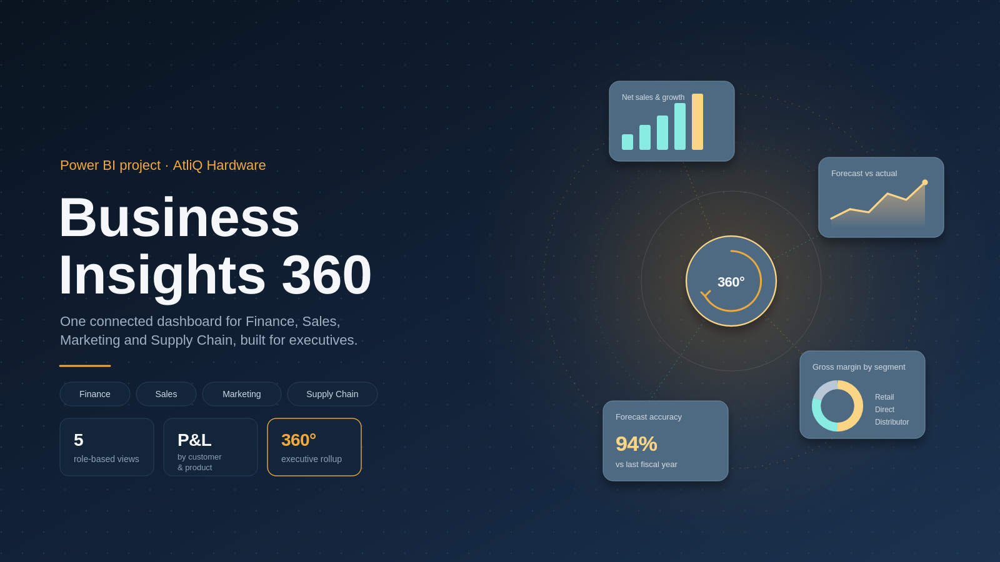

# Business Insights 360 — Power BI Project

A 360° Power BI dashboard built for **AtliQ Hardware**, unifying Finance, Sales, Marketing and Supply Chain data into a single, role-based reporting suite for executives.

## Overview

Business Insights 360 connects customer, product, market and time dimensions to fact tables for actuals and estimates, enabling P&L analysis by customer, product, or country over any time period. Instead of scattered reports for each function, this project gives every stakeholder — from finance to supply chain to the executive team — the same connected data model, viewed through the lens that matters to them.

## Report Views

| View | What it covers |
|---|---|
| **Finance View** | P&L and gross margin tracking by customer, product, and time period |
| **Sales View** | Customer performance, profitability and growth matrix |
| **Marketing View** | Product performance across net sales and gross margin |
| **Supply Chain View** | Forecast accuracy and net error by segment, category, and customer |
| **Executive View** | Top-level KPI rollup across all four functions, built for leadership |

## Key Features

- **P&L by any slice** — customer, product, country, or any combination, over any fiscal period
- **5 role-based report pages** tailored to different business functions
- **Forecast accuracy tracking** with net error breakdowns for supply chain planning
- **Gross margin analysis** by segment, market, and product line
- **Fiscal year & quarter slicers** for flexible period-over-period comparison

## Screenshots

**Executive View**

Consolidated rollup of top-level KPIs across Finance, Sales, Marketing and Supply Chain — including P&L, gross margin by segment, net sales & growth trends, and forecast accuracy — all on one page.

**Finance View**

P&L breakdown by customer, product, or country over any time period, with gross margin % tracked against fiscal year and quarter.

## Tools & Techniques

- **Power BI Desktop** — report design and data modeling
- **DAX** — time-intelligence measures, variance and growth calculations
- **Power Query (M)** — data cleaning and transformation into a star-schema model
- **Data model** — dimension tables (customer, product, market, date) connected to fact tables (actuals & estimates)

## Live Dashboard

If published to the Power BI Service, add the link here:

**[View Live Dashboard](https://app.powerbi.com/view?r=eyJrIjoiODMwNjJmNWMtMDgzMS00ZDZhLWE2OWYtMWNlNWY1MTM4YzU2IiwidCI6ImM2ZTU0OWIzLTVmNDUtNDAzMi1hYWU5LWQ0MjQ0ZGM1YjJjNCJ9)**

## About

Built as part of a Power BI project by [mohammedadilalit-del](https://github.com/mohammedadilalit-del), based on the AtliQ Hardware case study dataset.
